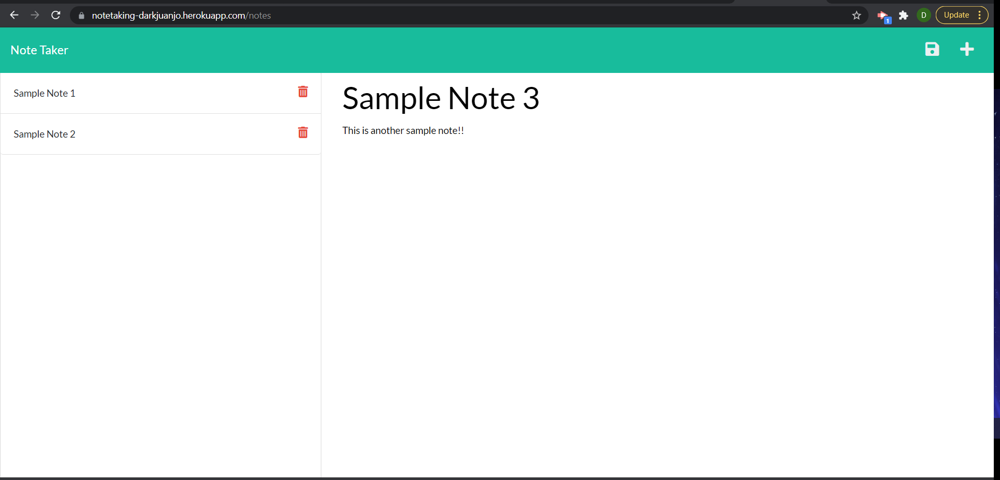
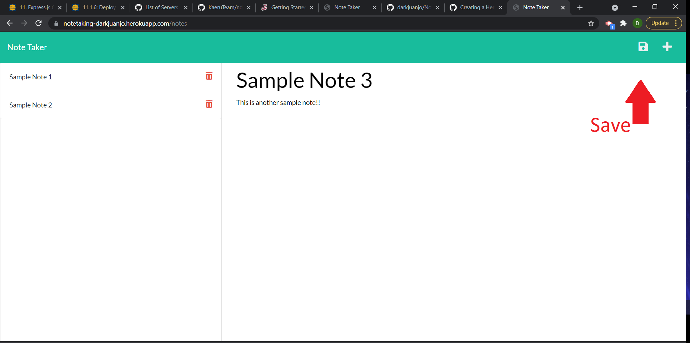
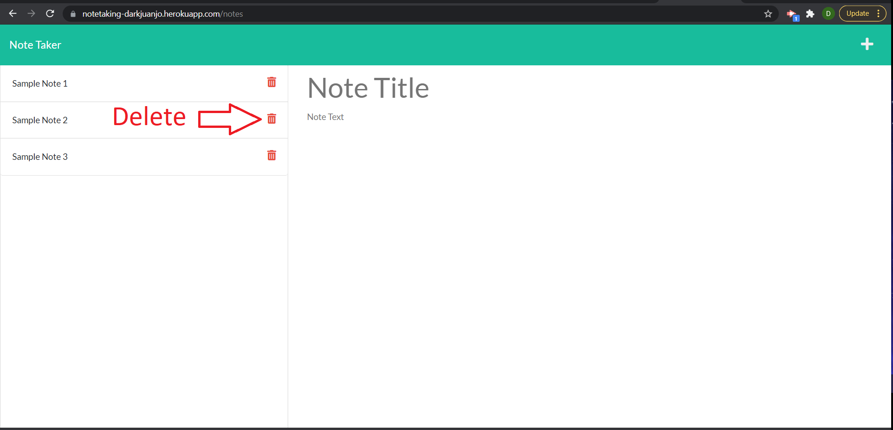
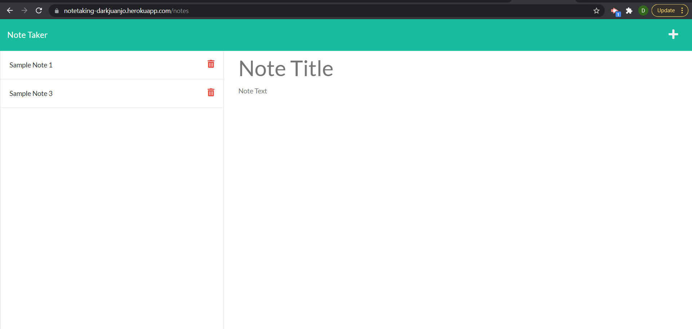

# Note Taker

## Description 

This is a simple note taker app that will create and store new notes. The note taker app will recieve a user input from the front end section of the code and store server will listen and store it in the dabase in the backend section. Note Taker also add a unique Id for each note that will be used to identify each note and delete them if the delete button is clicked.

## Table of Contents

* [Installation](#installation)
* [Usage](#usage)
* [Credits](#credits)
* [License](#license)

## Installation

1. No installation required just go to [https://notetaking-darkjuanjo.herokuapp.com/](https://notetaking-darkjuanjo.herokuapp.com/)

## Usage 

1. Go to [https://notetaking-darkjuanjo.herokuapp.com/](https://notetaking-darkjuanjo.herokuapp.com/)

2. click the Get Started button
3. Add notes to your hearts content!

4. Click the save icon on the top right to save 

5. To delete click the trash icon next in the notes title section

6. See image below delete note example

## Credits

[Xander Rapstine](https://github.com/Xandromus)

[John McCambridge](https://github.com/nol166)

[Juan José Paz](https://github.com/darkjuanjo)

## License

MIT
    